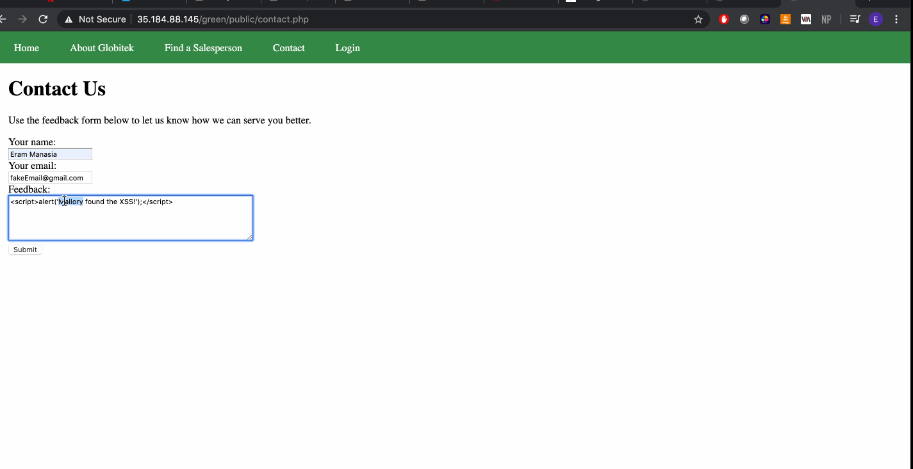

# Project 8 - Pentesting Live Targets

Time spent: 3 hours spent in total

> Objective: Identify vulnerabilities in three different versions of the Globitek website: blue, green, and red.

The six possible exploits are:
* Username Enumeration
* Insecure Direct Object Reference (IDOR)
* SQL Injection (SQLi)
* Cross-Site Scripting (XSS)
* Cross-Site Request Forgery (CSRF)
* Session Hijacking/Fixation

Each version of the site has been given two of the six vulnerabilities. (In other words, all six of the exploits should be assignable to one of the sites.)

## Blue

Vulnerability #1: Session Hijacking/Fixation

Open two sessions on 2 different browsers and open Target Blue. On the left, I was logged in with the credentials given and on the right, I was not logged in. Using "public/hacktools/change_session_id.php" I took the session id of the logged in session and changed the session id of the one on the right to the logged in session id. Now I was logged in on the session on the right.

Vulnerability #2: SQL Injection 

Tried changed id=1 to ?id=' OR 1=1'-- in the URL and the only site that gave a DataBase Query Failed error was blue, which was how I determined that blue had this vulnerability.

## Green

Vulnerability #1: Username Enumeration

When the user exists (jmonroe99), green gives a bold text indicating that the "Login was unsucessful" and when the user does not exist(jmonroe9), it does not.
Vulnerability #2: Cross-Site Scripting (XSS)

On the feedback form, I submitted  to the feedback. When I logged in with the credentials given I found the alert I sumbitted. This tells us that the site is vulnerable to XSS. 
## Red

Vulnerability #1: Insecure Direct Object Reference (IDOR)

I found salespeople that weren't supposed to be found by changing the id parameter in the URL. For example, I found someone who was fired which was not supposed to be available on the public site. We can see this is true as on the public site when I try to look for 'Lazy Lazyman' I can't find them.

Vulnerability #2: Cross-Site Request Forgery (CSRF)

When I change the csrf token on the green and blue sites and try to change the name of a user, it does not allow me to and says "Invalid Request". However, even though the csrf token is changed on red, we can still change the name of a user. This tells us the site is vulnerable to CSRF.

## Notes

Describe any challenges encountered while doing the work : 
1) User Enumeration took a while for me to figure out as I didn't pay attention to the bolding.

